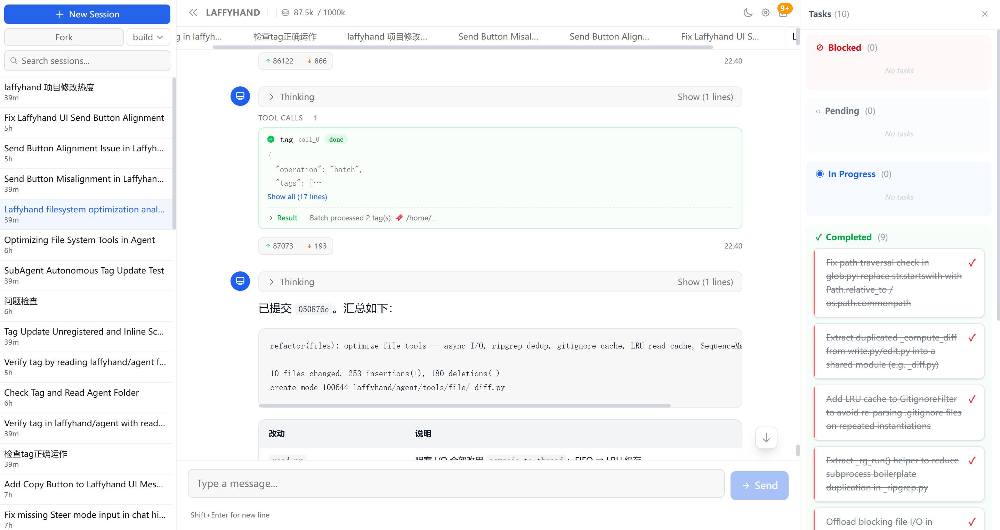

## Laffyhand -- A General Purpose AI Agent

<div align="center">


</div>

Laffyhand is a general purpose AI agent. It can complete programming tasks, search the internet for information, make plans and follow them to achieve goals, parse documents and store them in a vector knowledge base, and have personal memory.

<div align="center">
  
</div>

## Quick Start

### Prerequisites

- Python 3.14+
- [uv](https://docs.astral.sh/uv/) (Python package manager)
- Node.js 22+
- [pnpm](https://pnpm.io/) (Node.js package manager)

### Setup

```bash
# Clone the repository
git clone <repo-url> && cd laffyhand

# Install Python dependencies
uv sync

# Install frontend dependencies and build UI
cd laffyhand/ui && pnpm install && pnpm build && cd ../..

# Create configuration from example
cp laffyhand.example.yml laffyhand.yml
# Edit laffyhand.yml and fill in your LLM provider api_key
```

### Development

```bash
# Start the web UI (backend + frontend)
uv run laffyhand ui

# Or use the dev script (kills existing process, rebuilds UI, starts server)
./dev.sh
```

The web UI is available at http://127.0.0.1:9090.

### Production Build

```bash
# Build a single-file executable with Nuitka (Linux/macOS)
make build

# Windows
build.bat

# The binary is at dist/laffyhand (dist/laffyhand.exe on Windows)
```

On first launch the binary auto-creates a default `laffyhand.yml` in the current directory. Edit it to add your LLM provider configuration before use.


# Main Points

## Agent提示词设计

系统提示词采用分层组装的策略，每一个部分使用 XML 标签进行标识。

| 类型 | XML 标识 | 内容 |
|------|---------|------|
| Agent人格 | <soul> | ? |
| 环境信息 | <env> | 工作目录、平台、日期 |
| Skills | <skills> | 加载的 Skills |
| Preference | <preference> | 从 AGENTS.md 加载的用户偏好指令 |

AGENTS.md 开始时通过 <preference> 组装到系统提示词中，后续如果发现新的 AGENTS.md 采用 <system-reminder> 的方式进行增量注入，不修改系统提示词。

## 上下文溢出检测

使用提供商返回的 Usage 信息进行检测，假设提供商没有返回 Usage ，则永远不会触发溢出。每个 Agent 循环结束时，进行一次检测。如果提供商返回上下文溢出错误，则立刻进行溢出标注。

## Context Compression

使用 Compaction Agent 进行总结，然后保留后 N 条消息，插入总结摘要。发送给 Compaction Agent 的内容需要排除已经被总结过的信息，其消息长度预算为当前模型上下文的 25% ，消息累计方式为从倒数第 N 条信息开始向前累计，直到达到上限或者没有可以累计的消息。

消息累计过程中还需要对过长的工具调用消息进行截断处理。当一个会话已经被压缩过一次后，后续的压缩需要多传入上一次压缩的结果，让 Compaction Agent 根据本次需要压缩的内容进行更新。

## Plan and Build Agents

Build 模式下，不对 Agent 做特殊要求；当用户切换到 Plan 模式后，需要加载 Plan 模式的提示词（不加载到系统提示词）；用户切换 Plan/Build 通过插入 <system-reminder> 提醒模型。

## Multi-Provider & Model
将每个LLM API分解为**独立**的四个维度，每个维度能够**独立**替换，四个维度分别为：Protocol、Endpoint、Auth、Framing。组合四个维度能够获得不同的**Route**，通过Route能够直接完成全程的访问。

Protocol 负责解决怎么发送请求/解析数据，他不只关心如何构建出发送给提供商的请求体，如何解析从Framing层获取的帧为内部统一的流式响应格式。**只有 Protocol 知道各个提供商的原生字段**，项目的剩余位置均使用转换后的统一格式。

Endpoint 负责指定请求发送到什么位置。

Auth 负责处理发送请求的 Header，以便注入 API_KEY。

Framing 负责字节流到帧的转换。

全过程： LLMRequest（内部通用统一模型） → Protocol 构建原生请求体 → Transport 组装 URL+注入 Auth+序列化 → HTTP 发送 → Framing 字节流→帧 → Protocol 逐帧翻译为统一 LLMEvent → Stream<LLMEvent>

Route 是 Protocol、Endpoint、Auth、Framing 四个组件的组合容器，每个组件在管道中被 Route 按需调用。

需要在内部定义统一的数据类型/错误类型，将运营商层面的差异限制在 Protocol 层面。

事件	type 标签	关键字段
StepStart	step-start	index
TextStart	text-start	id
TextDelta	text-delta	id, text
TextEnd	text-end	id
ReasoningStart	reasoning-start	id
ReasoningDelta	reasoning-delta	id, text
ReasoningEnd	reasoning-end	id
ToolInputStart	tool-input-start	id, name
ToolInputDelta	tool-input-delta	id, name, text
ToolInputEnd	tool-input-end	id, name
ToolCall	tool-call	id, name, input
ToolResult	tool-result	id, name, result
ToolError	tool-error	id, name, message, error?
StepFinish	step-finish	index, reason, usage?
Finish	finish	reason, usage?

## Agent Tools

| Tool | Description | Design Detail |
|------|-------------|---------------|
| read | 读取文件或目录，支持图片/PDF 附件 | 流式逐行读取；行数上限 2000、单行截断 2000 字符、总字节上限 50KB；二进制基于空字节比例检测；图片/PDF 自动转 base64 附件；读取结果传递给 Agent 时，需要标注行号、文件路径、读取结果； |
| write | 写入文件（覆盖已有文件） | 写入前对比旧内容生成 unified diff 走权限审批；自动创建不存在的父目录 |
| edit | 精确字符串替换编辑文件 | \r\n/\n 行尾归一化 |
| glob | glob 模式匹配查找文件 | 基于 Ripgrep 引擎；结果按 mtime 从新到旧排序；硬限制 100 条 |
| grep | 正则表达式搜索文件内容 | 基于 Ripgrep 引擎；结果按 mtime 排序；最多 100 条匹配；行文本超 2000 字符截断；支持部分路径不可访问时跳过提示 |
| bash | 在持久 shell 中执行命令 | 利用 tree-sitter 解析命令 AST 提取路径做跨目录安全检查；持久 session 实现交互式命令；默认 2 分钟超时 |
| task | 启动子智能体处理多步骤任务 | 支持前台/后台两种模式；task_id 可恢复子会话；权限继承自父会话；后台任务完成后结果自动注入父会话 |
| question | 向用户提问以澄清需求 | 支持选择题（options）和自定义输入（custom）；答案同时存在 metadata.answers 中 |
| todowrite | 创建并维护任务清单 | 通过全量替换实现 CRUD（非增量操作）；每个任务含 content/status/priority |
| webfetch | 获取 URL 内容 | 最大 5MB；超时 120 秒；支持 markdown/text/html 格式转换 |
| websearch | 实时网络搜索 | None |
| skill | 加载技能注入指令和资源 | 根据名称加载预注册技能内容；自动列出技能目录下文件（最多 10 个）；路径说明输出到模型 |

设计特征：集中注册、并行调用、权限管理、输出截断、通过 API 字段传入可用工具。

## 工具输出修剪 (Pruning)

超出最近 40K 范围的工具结果，使用 [Old tool result content cleared] 进行代替。

## Agent循环


## 上下文管理
LLM摘要生成
工具输出修剪

## Skills系统
Skill文件结构解析，有效性校验
自动发现
Skill注入：通过System Prompt注入，并提供工具渐进式披露细节

## MCP服务
接入与使用，覆盖Stdio/SSE/Streamable HTTP三种类型

## 子代理系统

## 会话管理
历史记录
消息重试
会话重放

## 持久化存储

## 文档解析
PDF解析：Docling工具封装提取为Markdown
进行段落拆分、去重、清洗

## RAG
Chroma向量存储库
稠密+稀疏混合检索
分层检索（摘要/段落/语义块）
BM25+Reranker双路查询排序
查询改写/拓展
索引自动重建或者增量更新